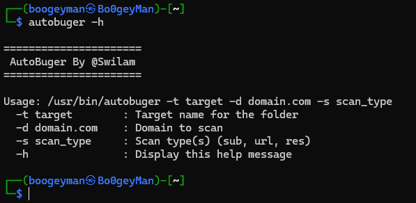
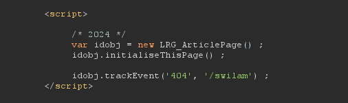
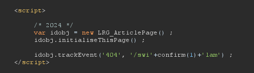
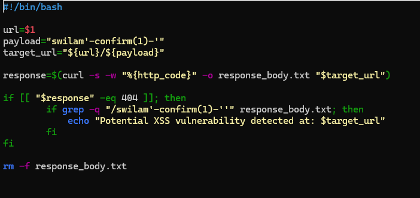
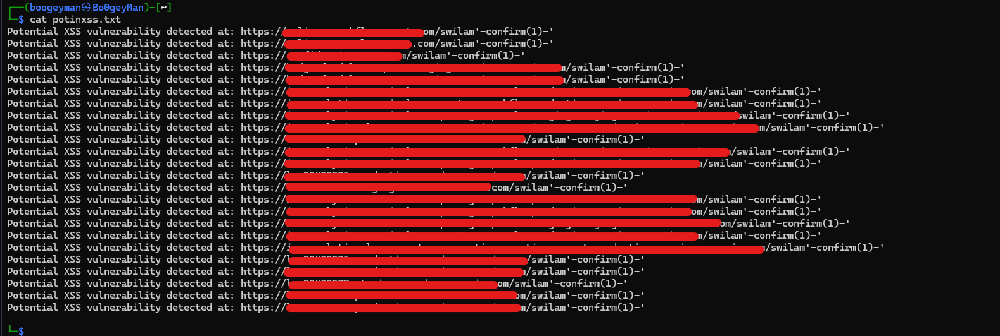

# 20+ XSS Vulnerabilities Using a Simple Technique

> **Author:** Mohamed Hammad (Swilam)
> **Category:** Cross-Site Scripting (XSS)

---

## Introduction

Alhamdulillah, I was able to discover **20+ XSS vulnerabilities at once** using a simple technique that I will explain in this write-up.

The main topics covered are:

* Information Gathering
* Vulnerability Discovery & Testing
* Automation

---

## 1. Information Gathering

I created a simple script that I may publish on GitHub soon.



Its main purpose is collecting subdomains from **8 different sources** commonly used for subdomain enumeration.

The sources are divided into **3 tools and 5 online services**:

* Subfinder
* Assetfinder
* Findomain
* Wayback Archive
* crt.sh
* Anubis
* Urlscan
* OTX

After collecting the subdomains, I filter them based on their HTTP status codes:

* **200:** These are the main targets for testing.
* **403:** Usually skipped during this process.
* **404:** Worth keeping because many potential subdomain takeover cases return 404.
* **3xx:** Interesting for testing potential Open Redirect vulnerabilities.

I then use `httpx` without additional flags to filter and validate the collected domains.

After that, the script collects URLs and endpoints from the discovered domains using:

* `waybackurls`
* `gau`

These are the three main stages of the script:

1. Subdomain enumeration
2. HTTP status filtering
3. URL and endpoint collection

Afterward, I start testing the domains returning `200` and begin looking for interesting functions and potential attack surfaces.

---

## 2. Vulnerability Discovery & Testing

While testing one of the discovered subdomains, I noticed that anything I entered into the `location.pathname` portion of the URL was reflected inside JavaScript code.



### What is `location.pathname`?

The pathname is the part of the URL that comes after the domain.

For example:

```text
https://example.com/swilam
```

The pathname is:

```text
/swilam
```

I started analyzing the JavaScript code and realized that I could break the existing string by manipulating the reflected value.

I split the original string into three parts and placed my payload in the middle:

```text
swi'+confirm(1)+'lam
```

This resulted in the JavaScript context being broken and my injected code being executed.



> **This is where programming becomes really important.**

But the journey wasn't over yet.

---

## 3. Automation

I found the same XSS vulnerability on **two additional subdomains**, using the exact same technique and the same reflection behavior inside the JavaScript code.

At that point, I suspected that the same vulnerability might exist across other subdomains as well.

But obviously, I wasn't going to test every subdomain manually.

So I decided to automate the process.

I created a simple Bash script that takes a subdomain and checks whether it behaves like the vulnerable targets I had already discovered.



The basic idea is to take a URL such as:

```text
https://example.com
```

and append the payload:

```text
/swilam'-confirm(1)-'
```

resulting in:

```text
https://example.com/swilam'-confirm(1)-'
```

The resulting URL is stored in `target_url`.

I then use:

```bash
curl -s -w "%{http_code}" -o response_body.txt "$target_url"
```

The script checks the HTTP response code and saves the response body.

I then check whether:

1. The response returns `404`.
2. My payload is reflected in the response body.

If both conditions are met, there is a high chance that the target is vulnerable to the same XSS scenario.

The `-s` flag is used to keep the output quiet, and the temporary response file is removed afterward.

> **This is where programming becomes important - once again.**

---

## Testing Multiple Subdomains

You might wonder how I passed a file containing multiple subdomains to a script that accepts a single URL at a time.

Simple:

```bash
while read -r url; do
    ./myScript.sh "$url" >> potinxss.txt
done < Subdomains.txt
```

This reads every URL from `Subdomains.txt` and passes it to the script one by one.

Then I let the automation run.



And finally...

**24 subdomains were found to be vulnerable to the same XSS scenario.**

---

## Conclusion

That's it for this write-up.

The main takeaway is that once you identify a repeatable vulnerability pattern, **automation can help you scale the same testing methodology across a larger attack surface**.

I hope this write-up was useful, even in a small way.

---

**Research. Learn. Automate. Repeat.**
